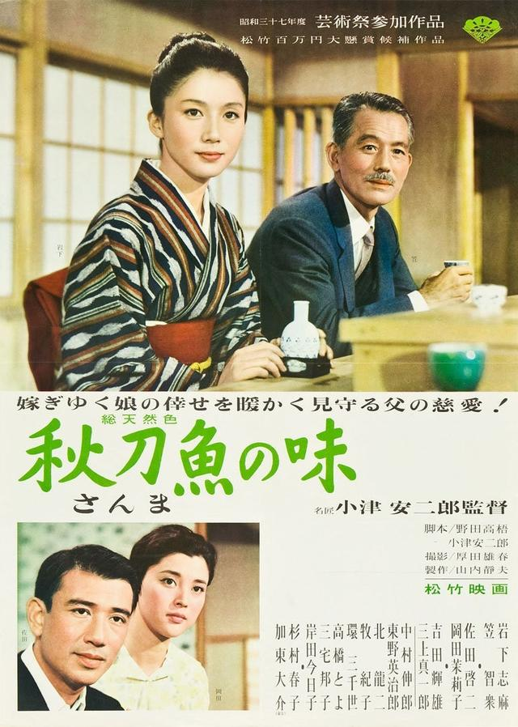

# [&laquo;An Autumn Afternoon (1962)&raquo;](https://www.imdb.com/title/tt0056444/?ref_=fn_al_tt_1)

  

- Director: 小津安二郎 
- Writers: 野田高梧, 小津安二郎 
- Stars: 笠智众, 岩下志麻, 冈田茉莉子，佐田启二，三上真一郎  
- Date&Location: 11/28/2018, SYSU/351 （木鱼微剧场）

## Storyline
妻子去世多年，寡言的山平（笠智众）已习惯被待嫁的女儿道子（岩下志麻）贴心照料的生活。道子表面看来也乐意将老父亲照料，从没流露嫁人的渴望。 
山平老年乐事是与中学时代的几个老友饮酒叙谈，席间友人每谈及道子的婚事、表示要同她介绍对象，山平总会含糊其辞地拒绝，但怕面对什么，他也并不能想清。不过每次饮酒他都会适可而止，以避免酒醉给道子带来太多麻烦。  
这日中学同窗聚会，山平得知老师当年漂亮的女儿为将他照顾至今未嫁，后送醉酒的老师归家，见漂亮人儿今已衰老憔悴，他心里一惊，想到道子。其后，他示意道子考虑婚姻大事，道子却理解为父亲在赶她出门悲伤不已，他好言相劝她方含泪点头。道子答应一刻，他又心生无限酸楚。 
 ©[豆瓣](https://movie.douban.com/subject/1294433/) 

In the early 60's in Tokyo, the widower Hirayama is a former captain from the Japanese navy that works as a manager of a factory and lives with his twenty-four year-old daughter Michiko and his son Kazuo in his house. His older son Koichi is married with Akiko that are compulsive consumers and Akiko financially controls their expenses. Hirayama frequently meets his old friends Kawai and Professor Horie, who is married with a younger wife, to drink in a bar. When their school teacher Sakuma comes to a reunion of Hirayama with old school mates, they learn that the old man lives with his daughter that stayed single to take care of him. Michiko lives a happy life with her father and her brother, but Hirayama feels that it is time to let her go and tries to arrange a marriage for her.

 —Claudio Carvalho, Rio de Janeiro, Brazil

## Excellent Reviews
- [【木鱼微剧场】《秋刀鱼之味》小津安二郎最后一部电影](https://www.bilibili.com/video/av36950469)

### 木鱼的短评：

劝君莫惜金缕衣，

劝君惜取少年时。

花开堪折直须折，

莫待无花空折枝。

（本人备注：《金缕衣》是唐朝时期的一首七言乐府）

&emsp;&emsp;只是，我们常常怜惜金缕衣，却没有在有花堪折的时候去折花。生活中的我们，常常更多看见别人把握住机会后的庆幸，却又想起自己错过的机会而悔恨。人生不能只在等待中，必须要挥棒，而人生最大的遗憾，又常常是挥棒的时候已经晚了。