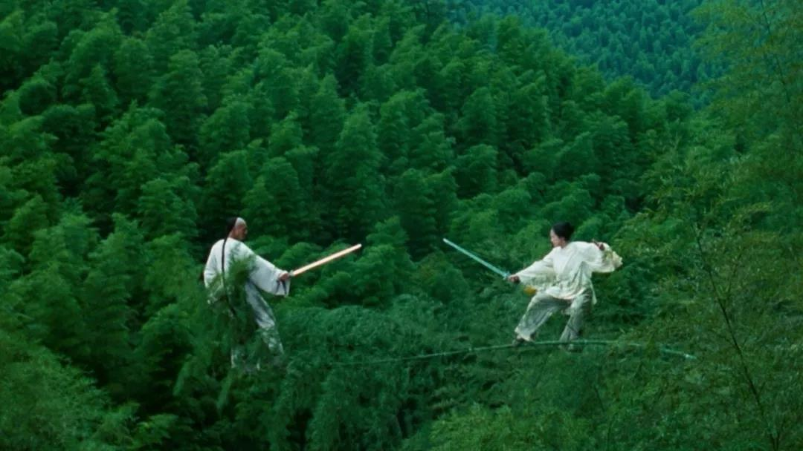

# [&laquo;Crouching Tiger Hidden Dragon (2000)&raquo;](https://www.imdb.com/title/tt0190332/?ref_=fn_al_tt_2)

  

- Director: Ang Lee 
- Writers: Du lu wang (book), Hui-Ling Wang (screenplay) 
- Stars: Yun-Fat Chow, Michelle Yeoh, Ziyi Zhang，Chen Chang  
- Date&Location: 12/06/2018, SYSU/351 （木鱼微剧场）

## Storyline
一代大侠李慕白（周润发饰）有退出江湖之意，托付红颜知己俞秀莲（杨紫琼饰）将青冥剑转交给贝勒爷（郎雄饰）收藏，不料当夜遭玉娇龙（章子怡）窃取。俞秀莲暗中查访也大约知道是玉府小姐玉蛟龙所为，她想办法迫使玉蛟龙归还宝剑，免伤和气。但李慕白发现了害死师傅的碧眼狐狸（郑佩佩饰）的踪迹，她隐匿于玉府并收玉蛟龙为弟子。而玉蛟龙欲以青冥剑来斩断阻碍罗小虎（张震饰）的枷锁，他们私定终身。关系变得错综复杂，俞秀莲和李慕白爱惜玉蛟龙人才难得，苦心引导，但玉蛟龙却使性任气不听劝阻…… 

©[豆瓣](https://movie.douban.com/subject/1301168/)

Crouching Tiger Hidden Dragon is a timeless story that takes place in QING China when miracles were credible and spirits and gods were present in man's world. It is not unbelievable that zen warriors float through the air, skim the water and battle in trees and on rooftops. Pain, revenge and duty are the stuff that bind us in this world and are the main plot line of the movie, but in the afterlife, love and faith linger on.

—bastetg4

## Excellent Reviews
- [【木鱼微剧场】《卧虎藏龙》李安导演作品，首部获奥斯卡最佳外语片的华语电影](https://www.bilibili.com/video/av37556785)

### 木鱼的短评摘录：
《卧虎藏龙》是李安导演的电影，上映于2000年，由周润发、杨紫琼、章子怡和张震联袂出演。影片曾获**第73届奥斯卡最佳外语片、最佳艺术指导、最佳原创配乐和最佳摄影四项大奖**。作为一部非英语的华语商业电影，能获得奥斯卡最佳外语片奖，实在是一个莫大的荣誉了。

影片是一部武侠类型片，打斗场面在电影里占相当大的篇幅，而电影的打斗段落不可谓不精彩。影片打斗保持了一种「在适度想象下的写实感」，比如俞秀莲和玉娇龙对决时候的刀口，又比如没有为了表现力度而过分夸张的打斗，还有对「凌空点穴」这类奇幻要素的避免。比较起来的话，这样的武侠应该算是偏「中低魔」的。

不管是刀枪棍棒还是飞檐走壁，李安其实**给每种武功和每段对决都安排了不同的质感和基调**，比如武林门人对碧眼狐狸的打斗，为的是制胜，出招实用，具有**江湖气**，俞秀莲和玉娇龙那场，拼尽全力，重点在于**争一个胜败**，而李慕白和玉娇龙的对决，则是理念大于胜负，**重在意境**。

  

故事是一个悲剧，李慕白和俞秀莲两人虽然相爱，但却碍于社会评价与两人之间的好友孟思昭，谁也不愿意挑明。他们似乎**遵循了社会规则与责任，却错过了自己的幸福**。

在故事最后，李慕白用本来可以炼神还虚的最后一口气向俞秀莲表白，他说我已经错过了这一生。他为了责任过了一生，收徒，除暴安良，报仇，最后却都没有向最爱的人表白，他觉得有些**后悔**。于是在生命的最后时刻，他认为要珍惜当下，向俞秀莲说出了自己的心情。

而俞秀莲也瞬间明白了这一点，李慕白死后，她对赶来的玉娇龙说，要真诚的对待自己，其实是让她遵循本心去过生活，因为俞秀莲一生都为了责任，最后却**落得这样的结局**。

所以，其实故事所讨论的，是一个内心自由与责任约束的故事。说起来，李慕白其实和玉娇龙比较像，他们内心深处都是想要追求自由的人。只不过李慕白是玉娇龙的成年版本，多年的生活让他明白自己必须遵循社会规则，而**玉娇龙则还没有被社会所洗礼**。

俞秀莲和罗小虎比较类似，他们更多考虑社会的规则。比如俞秀莲碍于玉大人和贝勒爷，明明知道玉娇龙的身份却不挑明。又比如罗小虎明明可以和玉娇龙浪迹天涯，却把她送回去，说自己要干一番事业之后光明正大地迎娶玉娇龙。

只是，不管是玉娇龙、李慕白、罗小虎和俞秀莲，他们在故事最后都没有如愿。电影最后描述了这种令人叹息的吊诡。***追求自由的人会发现社会责任是重要的，因为一眛地追求自由，会陷入孤独的境地。而追求社会责任的人却发现，自己一生为了责任，却可能错过了真正爱的人，错过了向 ta 表达心意的时刻***。

我想这就是电影主题的复杂性。它其实并没有明确的表示应该追求自由或者应该遵守社会责任，而是留下了一个问句，留给观众来探讨。

## Classic Lines
1. 师父一直说，把手握紧，里面什么都没有。把手松开，你就拥有了一切。