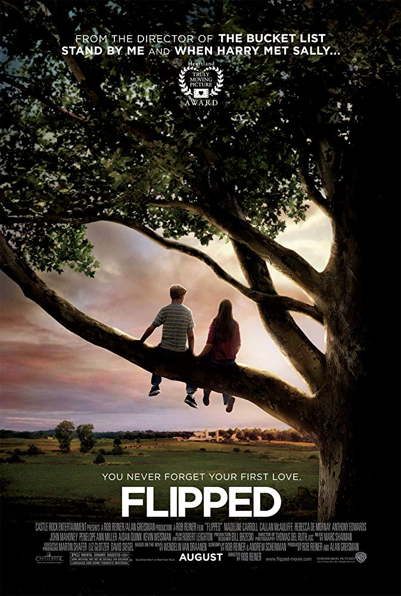

# [&laquo;Flipped (2012)&raquo;](https://www.imdb.com/title/tt0817177/?ref_=fn_al_tt_1)

  

- Director: Rob Reiner 
- Writers: Rob Reiner, Andrew Scheinman (screenplay), Wendelin Van Draanen (novel) 
- Stars: Madeline Carroll, Callan McAuliffe, Rebecca De Mornay  
- Date&Location: 11/29/2018, SYSU/351 （爱奇艺）

## Storyline
In 1957, when second-graders Bryce Loski and Julianna "Juli" Baker first meet, Juli knows it's love, but Bryce isn't so sure and tries to avoid Juli. By the sixth grade, in 1961, Bryce tries to get rid of Juli by dating Sherry Stalls, whom Juli despises. However, Bryce's best friend, Garrett, takes an interest in Sherry and eventually tells her the truth about Bryce asking her out; she doesn't take it well. From Juli's perspective, Bryce returned her feelings, but was shy. After finding out Bryce and Sherry broke up, she thought she could have Bryce back. But then they reconsider their decisions as time goes on. In 1962, Bryce's grandfather Chet Duncan moves in with the family. Chet has different views about Juli. There's a large, old sycamore tree that Juli loves which no one else understands. One day, it's cut down by a group of landscapers so a house can be built there, despite Juli's opposition. She becomes very depressed afterwards, as the tree let her see the world in a more enlightened way. Her father gives her a painting of the tree. 
Juli Baker devoutly believes in three things: the sanctity of trees (especially her beloved sycamore), the wholesomeness of the eggs she collects from her backyard flock of chickens, and that someday she will kiss Bryce Loski. Ever since she saw Bryce's dazzling brown eyes back in second grade, Juli has been smitten. Unfortunately, Bryce has never felt the same. Frankly, he thinks Juli Baker is a little weird--after all, what kind of freak raises chickens and sits in trees for fun? Then, in eighth grade, everything changes. Bryce begins to see that Juli's unusual interests and pride in her family are, well, kind of cool. And Juli starts to think that maybe Bryce's dazzling brown eyes are as empty as the rest of Bryce seems to be. After all, what kind of jerk doesn't care about other people's feelings about chickens and trees? With Flipped, mystery author Wendelin Van Draanen has taken a break from her Sammy Keyes series, and the result is flipping fantastic. Bryce and Juli's rants and raves about each other ring so true that teen readers will quickly identify with at least one of these hilarious feuding egos, if not both. A perfect introduction to the adolescent war between the sexes.
—anonymous

## Excellent Reviews
- [【木鱼微剧场】《怦然心动》 罗伯莱纳](https://www.bilibili.com/video/av7866383)
  《怦然心动》是导演罗伯莱纳于 2012 年的影片，改编自文德琳·范德拉安南的儿童文学小说《怦然心动》，这种纯情的恋爱故事，虽然是少男少女的小心思和小决定，却也呈现得相当动人。
  因为影片改编自小说，更多是两个青春期的少年少女内心世界的变化，而故事本身比较少有外在层面的冲突，可以算是一个小情节故事。如果平铺直叙地拍出来，则会觉得太过波澜不惊，并且
  难以展现故事的精髓。正因为如此，影片采用了双主线双第一人称平行叙事的方式来推进情节，利用主观叙述视角上的便利，一个故事在前一个人看是一个样，而后面则会揭示从另一人角度看
  起来的截然不同的真相。交替叙述来回揭示，把剧情推进得环环相扣，水到渠成，把青春时候的甜蜜和青涩都展现了出来。其实，从青春期最早的开始时，男男女女便对身边的人怦然心动，芳
  心暗许，彼此吸引。但是，这样的心动是因为漂亮的外表，是因为帅气的衣服， 是因为篮球场上的英姿，或是一举手一投足？在喜欢产生的时候，突如其来，谁也不知道为什么？只是，帅气的
  外表终会被粗俗的行为破坏。漂亮的眼睛也会虚荣而黯淡，所以，自己魂牵梦萦的到底是一个可以了解到梧桐树顶端的风景有多美，了解叔叔的纯真以及父母的辛苦的人，还是一个虚有其表，
  在意耳洞，只会攀比，却嘲笑一个因为悲剧导致的智力障碍者的人呢？作者借着这样青春少男少女的爱情故事，讲述的却不仅仅是小小恋爱，而是外表和内在的故事。比如男主的父亲，虽然外
  表光鲜，内心却已经腐朽，忘记了真正重要的事情，钻进了金钱和权力的追逐中，渐渐失去了自己的本心。而另一些人则不是如此，他们没有忘记人性中最重要的那些东西。虽然他们也会被世
  界和所爱的人所缠累，但他们确实了解人生中哪些是重要的。所以，到这里，也就如同里面最经典的那句台词所说，有人外表平庸，有些人外表华丽耀眼，但是你总会遇到一些人，有内而外地
  散发着彩虹般的光芒，一旦遇见过，别人对你来说都不过是浮云，那么，你能不能遇到那个人呢？当追求爱情的时候，你到底是不是爱他的美好内心呢？朱莉和布莱斯都是这样选择的。

- 神弹幕：斯人若彩虹，遇上方知有。

- 我的看法：此次重温这部片子，我的关注点已经不是朱莉和布莱斯之间的纯情爱恋，而是开始思考人生中究竟什么是最重要的呢？以前的我太过沉醉于自己的学业，太过纠结自己的前途，而最为
  重要的家庭关系。回想自己的成长经历，我的金钱观其实很早就形成了，早早就会像朱莉那样担心自己的家境被别人看不起。同时由于自己心智的不成熟，会把金钱，房子等物质条件看的过重，
  因而难免会心生自卑，从而忽略了生活中真正美好的东西。看完此片，我真的希望以后可以活成朱莉一家的样子，每个人都能有自己内心的坚持与归属，生活平淡有趣，不会为金钱等物质条件过
  于烦恼忧心，过着让人羡慕的 decent life。其实啊，我自己的成长历程，我得到的物质水平和教育资源已经非常算是同龄人中非常好的了，只是当初的自己没察觉，不满足。真的是naive啊，
  得多读书，多见世面，继续好好修炼。

## Classic Lines
1. Some of us get dipped in flat, some in satin, some in gloss... But every once in a while you find someone who's iridescent, and when you do, nothing
will ever compare.