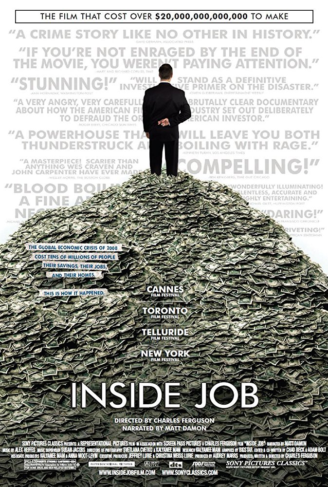

# [&laquo;Inside Job (2010)&raquo;](https://www.imdb.com/title/tt1645089/?ref_=nv_sr_1)

  

- Director: Charles Ferguson 
- Writers: Charles Ferguson, Chad Beck & Adam Bolt 
- Stars: Matt Damon, Gylfi Zoega, Andri Snær Magnason  
- Date&Location: 11/26/2018, SYSU/351

## Storyline
'Inside Job' provides a comprehensive analysis of the global financial crisis of 2008, which at a cost over $20 trillion, caused millions of people to lose their jobs and homes in the worst recession since the Great Depression, and nearly resulted in a global financial collapse. Through exhaustive research and extensive interviews with key financial insiders, politicians, journalists, and academics, the film traces the rise of a rogue industry which has corrupted politics, regulation, and academia. It was made on location in the United States, Iceland, England, France, Singapore, and China.

Written by Anonymous

## Excellent Reviews
- [【科普】这部纪录片为何获得奥斯卡奖？解析揭秘金融危机的《监守自盗》](https://www.bilibili.com/video/av23823087?from=search&seid=15605566932457884496)

第83届奥斯卡金像奖最佳纪录长片《监守自盗》 通过追访全球金融街商人，政客，财经记者还原了2008年金融危机前，美国金融圈的内幕，在西方
经济学的设定中，认识主观利己，客观利他的，一个完善的系统能让每个人的利己行为都使整个社会变得更好，比如完善的金融体系中，金融机构遵循法规运作，
才不会受罚；监管机构揪出金融机构的漏洞，才能受到奖励；二者为了各自利益互为掣肘，但在《监守自盗》披露的事实中，金融公司为了利益欺瞒客户，
经济学者收受贿赂，发表违背事实的研究结论，监管机构坐视不理，没有发挥任何作用，危机如当头棒喝，让全球意识到监管的重要性，当正如影片最后所说
我们度过了灾难，但导致灾难的机构仍在掌权，他们承诺这一切不会重演，却还是会不顾一切追求利益。这一切都不会容易，但至少还有一些东西值得我们去奋斗。

