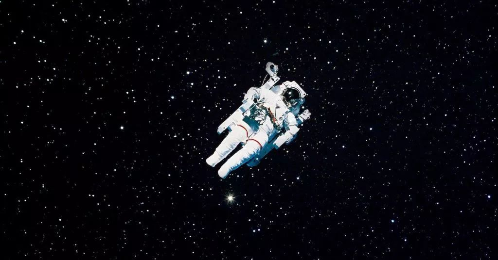

# [Interstellar (2014)](https://www.imdb.com/title/tt0816692/?ref_=fn_al_tt_1)

  

- Director: Chistopher Nolan 
- Writers: Jonathan Nolan, Christopher Nolan 
- Stars: Matthew McConaughey, Anne Hathaway, Jessica Chastain  
- Date&Location: 12/28/2018, SYSU/351 （木鱼微剧场）

## Storyline

Earth's future has been riddled by disasters, famines, and droughts. There is only one way to ensure mankind's survival: Interstellar travel. A newly discovered wormhole in the far reaches of our solar system allows a team of astronauts to go where no man has gone before, a planet that may have the right environment to sustain human life.

—ahmetkozan

## Excellent Reviews
- [【木鱼微剧场】诺兰作品《星际穿越》，严谨的科学精神与深刻人文关怀（Re:C）](https://www.bilibili.com/video/av38334623)

### 木鱼的短评：

人类都爱真理，但人类却不能只依靠逻辑和公式来生活，人类需要爱，但人类也不能放弃技术和科学，整天用爱发电。我们曾经见过太多偏向一边，从而导致悲剧的故事。我想这或许说明了人类的一种内在天性，那就是我们喜欢同时具有严谨的科学精神与深刻人文关怀的东西。在剧本创作中，我们比较喜欢把他们叫做「见识」和「情感」。而在我们见到的这些电影里，其实只要其中任何一个很高，影片都足以进入「好片」的范畴，同时在「见识」和「情感」这两点都很高的作品，应该说是凤毛麟角。而《星际穿越》却无疑是这类两者兼备作品中的一员。

## Music

Interstellar reminds me of one of my favorite song, the space oddity written and played by David Bowie.

《Space Oddity》最初收录在 1969 年 David Bowie 的第二张录音室专辑《David Bowie》中。但由于 Bowie 在 1967 年发表的第一张专辑名称用的也是他的艺名，所以为了不搞混两张专辑，1969 年的第二张专辑也被称为《Space Oddity》。

‘Space Oddity’这个名字影射的是 1968 年出版的 Stanley Kubrick 经典电影《2001: The Space Odyssey》（2001太空漫游）。从 1969 至今，这首歌带人类穿越了几十年前幻想中的宇宙，到现在科技发达到在太空进行这首歌的录音。人类不断发展与进化，科技不断的更新，唯独不变的还是艺术裡找到恒久的人性和对生命仍然充满探索的渴求。

  

1969年7月， David Bowie 发行了《Space Oddity》，这首歌讲述「汤姆少校」作为太空人在执行月球登陆计划时，不幸发生机件短路意外，和美国太空总署失去联系，于是坐在小如锡罐的太空舱内，望着蔚蓝的地球什么都做不了，只能永远的漂流在黑暗孤寂的太空当中。

歌曲无不体现着汤姆少校漂流太空的无助和孤独，歌词也不断重复着 ”Ground control to Major Tom”， 这种持续呼喊想与别人取得联系，极力尝试抓住一点点安全感，有希望，也有绝望。

在歌曲最后，汤姆少校被留在太空当中，似乎已经放弃求生。但另一个角度来看，其实那不是消极的状态，而是勇敢面对那极度的孤独，放手让自己漂流在孤寂的空间里，与自己对话，而不是慌张寻找依靠。

## Reference
[来自外太空的歌—Space Oddity by Roland罗兰在线](http://www.sohu.com/a/260313811_664895)
