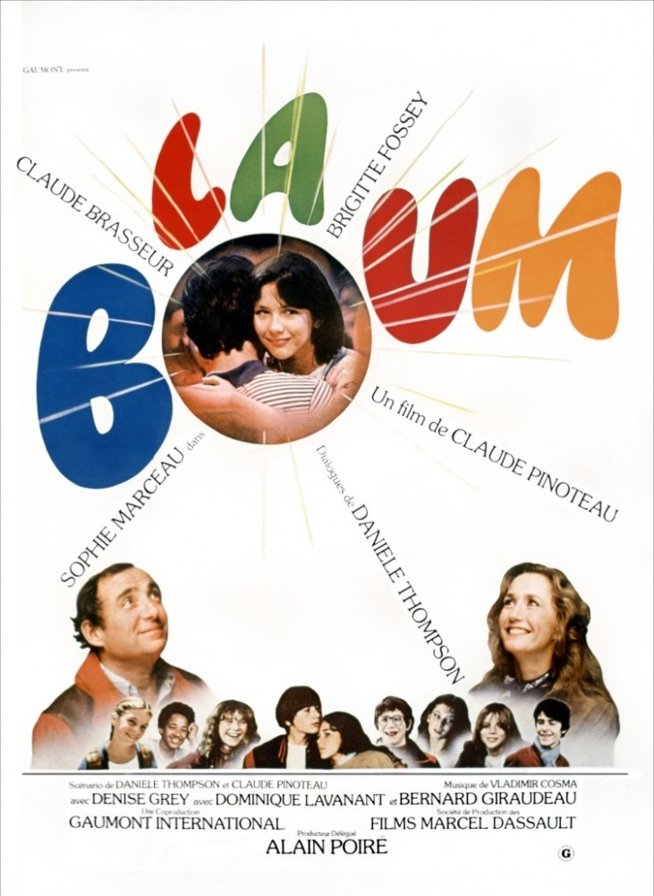

# [&laquo;La boum (1980)&raquo;](https://www.imdb.com/title/tt0082100/?ref_=fn_al_tt_1)

<div align="center">  </div>

- Director: 小津安二郎<br>
- Writers: 野田高梧, 小津安二郎<br>
- Stars: 笠智众, 岩下志麻, 冈田茉莉子，佐田启二，三上真一郎<br><br>
- Date&Location: 11/28/2018, SYSU/351 （木鱼微剧场）

## Storyline
妻子去世多年，寡言的山平（笠智众）已习惯被待嫁的女儿道子（岩下志麻）贴心照料的生活。道子表面看来也乐意将老父亲照料，从没流露嫁人的渴望。<br>
山平老年乐事是与中学时代的几个老友饮酒叙谈，席间友人每谈及道子的婚事、表示要同她介绍对象，山平总会含糊其辞地拒绝，但怕面对什么，他也并不能想清。不过每次饮酒他都会适可而止，以避免酒醉给道子带来太多麻烦。 <br>
这日中学同窗聚会，山平得知老师当年漂亮的女儿为将他照顾至今未嫁，后送醉酒的老师归家，见漂亮人儿今已衰老憔悴，他心里一惊，想到道子。其后，他示意道子考虑婚姻大事，道子却理解为父亲在赶她出门悲伤不已，他好言相劝她方含泪点头。道子答应一刻，他又心生无限酸楚。<br>
 ©[豆瓣](https://movie.douban.com/subject/1294433/)<br>

In the early 60's in Tokyo, the widower Hirayama is a former captain from the Japanese navy that works as a manager of a factory and lives with his twenty-four year-old daughter Michiko and his son Kazuo in his house. His older son Koichi is married with Akiko that are compulsive consumers and Akiko financially controls their expenses. Hirayama frequently meets his old friends Kawai and Professor Horie, who is married with a younger wife, to drink in a bar. When their school teacher Sakuma comes to a reunion of Hirayama with old school mates, they learn that the old man lives with his daughter that stayed single to take care of him. Michiko lives a happy life with her father and her brother, but Hirayama feels that it is time to let her go and tries to arrange a marriage for her.

 —Claudio Carvalho, Rio de Janeiro, Brazil

## Excellent Reviews
- [【木鱼微剧场】《秋刀鱼之味》小津安二郎最后一部电影](https://www.bilibili.com/video/av36950469)

## music
```
Reality

Richard Sanderson

met you by surprise
无意间与你相遇
i didn't realize
我却没有意识到
that my life would change forever
生命会因此改变
saw you standing there
见你伫立在那儿
i didn't know i'd care
我不知自己在意
there was something special in the air
那空气与众不同
dreams are my reality
梦境是我的现实
the only kind of real fantasy
唯一真实的幻想
illusions are a common thing
幻想已归于平淡
i try to live in dreams
我试着活在梦中
it seems as it's meant to be
这似乎本应如此
dreams are my reality
梦境是我的现实
a different kind of reality
一种不同的现实
i dream of loving in the night
我梦见夜晚相爱
and loving seems alright
爱仿佛如此自然
although it's only fantasy
即使这只是幻想
if you do exist
如果你真的存在
honey don't resist
亲爱的不要抗拒
show me a new way of loving
给我爱的新方式
tell me that it's true
告诉我这是真的
show me what to do
向我演示如何做
i feel something special about you
你令我感到特别
dreams are my reality
梦境是我的现实
the only kind of reality
唯一存在的现实
maybe my foolishness is past
或许我不再愚蠢
and maybe now at last
也许只有这样了
i'll see how the real thing can be
我将见真实如何
dreams are my reality
梦境是我的现实
a wondrous world where i like to be
渴慕的美妙世界
i dream of holding you all night
我梦中与你相拥
and holding you seems right
与你如此的自然
perhaps that's my reality
也许那即是现实
met you by surprise
无意间与你相遇
i didn't realize
我却没有意识到
that my love would change forever
生命会因此改变
tell me that it's true
告诉我这是真的
feeling that are new
多么新奇的感觉
i feel something special about you
你令我感到特别
dreams are my reality
梦境是我的现实
a wondrous world where i like to be
渴慕的美妙世界
illusions are a common thing
幻想已归于平淡
i try to live in dreams
我试着活在梦中
although it's only fantasy
尽管这只是幻想
dreams are my reality
梦境是我的现实
i like to dream of you close to me
愿梦中与你亲近
i dream of loving in the night
我梦见夜晚相爱
and loving you seems right
爱仿佛如此自然
perhaps that's my reality
也许那就是现实
```