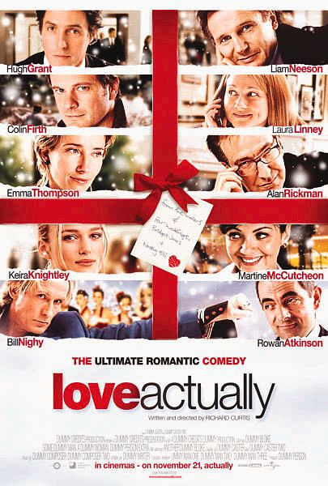
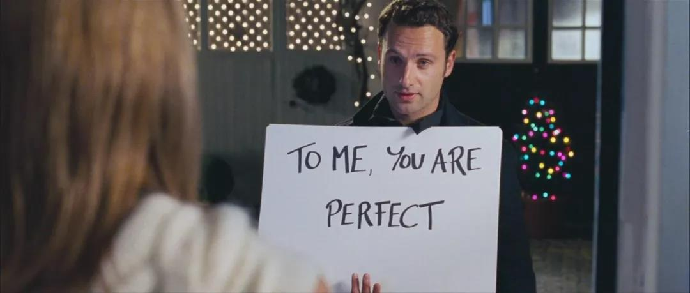

# [&laquo;Love Actually (2003)&raquo;](https://www.imdb.com/title/tt0314331/?ref_=fn_al_tt_1)

  

- Director: Richard Curtis 
- Writers: Richard Curtis 
- Stars: Hugh Grant, Liam Neeson, Colin Firth, Laura Linney, Emma Thompson, Alan Rickman, Keira Knightley, Martine McCutcheon,
         Bill Nighy, Rowan Atkinson  
- Date&Location: 12/27/2018, 惠州太东集团宿舍（木鱼微剧场）

## Storyline
Follows the lives of eight very different couples in dealing with their love lives in various loosely interrelated tales all set during a frantic month before Christmas in London, England. 

—Alastair Battrick

Against the backdrop of aged has-been rock star Billy Mack's Christmas themed comeback cover of "Love Is All Around" which he knows is crap and makes no bones about it much to his manager Joe's chagrin as he promotes the record, several interrelated stories about romantic love and the obstacles to happiness through love for Londoners are presented in the five weeks preceding Christmas. Daniel's wife has just passed away, leaving him to take care of his adolescent stepson Sam by himself. Daniel is uncertain how to deal with Sam and his problems without his wife present, especially in light of a potential budding romance within their household. Juliet and Peter have just gotten married. They believe that Peter's best friend and best man Mark hates Juliet but won't say so to his or her face. Others looking at the situation from the outside believe Mark is jealous of Juliet as he is in love with Peter himself. Jamie, a writer, is taking a writing retreat by himself in rural France following catching his latest girlfriend in an indiscretion. Jamie ends up spending much time in France with Aurélia, the Portuguese woman hired as the housekeeper. The question becomes not only if they can communicate their day-to-day needs with each other as she speaks no English, he speaks no Portuguese, and neither speaks French well, but communicate what seems to be their increasing mutual attraction to each other. Sarah has been in love with her co-worker Karl for the two years they have worked together, this attraction which everyone in their workplace knows about. Sarah has to decide if she can be forward enough to express this love directly to Karl, especially in light of what has been her personal priority of dealing with a family issue. Harry and Karen have been in a stable long term marriage. His new assistant Mia drops hints to him that she would like them to be romantically involved. Harry has to decide whether to fall to the temptation, especially considering being married to a perceptive wife. Single and relatively young David is the newly elected Prime Minister. At 10 Downing Street, he is attracted to one of the new household servants, slightly overweight Natalie, but isn't sure what to do about it seeing as to their respective positions, the probable public scrutiny, and an incident involving the visiting U.S. President. Socially unaware Colin believes that the lack of romantic love in his life is all the fault of standoffish British women. As such, he decides to take decisive albeit somewhat unusual geographic action. And John and Judy are movie body doubles. They can communicate with each other straightforwardly while they are simulating sex filming a movie, but they may not be able to translate the feelings behind that simulation in real life to each other.

—Huggo

## Excellent Reviews
- [【木鱼微剧场】《真爱至上》众星云集的经典爱情喜剧](https://www.bilibili.com/video/av39034561?from=search&seid=12638876367022761872)

### 木鱼的短评：

一般电影的场景是40~60个，而本片有10个左右的故事，每个故事能分到的只有平均4~6个场景。那么这些场景是如何串联的呢？其实串联故事的并不是逻辑，而是情绪。影片基本可以分成三段，第一段是介绍每个故事的主角和背景，给所有人一个初始的介绍，搭配上快乐情绪给人一个轻松的开场，而中间那段则是给每个小故事一个转折，这时情绪会被带得有些担心，甚至紧张，直到影片的最后段落，随着那些故事的最后交汇，让人感动得会心一笑，但这种笑容与影片一开始的轻松又不太一样，那是一种感觉到爱的幸福。

诚然，并不是所有努力都会有结果，生活也不会因为这一天的快乐而改变。但来自于节日的，在这种仪式般文化的感召下团聚的人群，却可以给我们带来温暖，而这份温暖是每个人生命中不可缺少的存在，它将陪伴着我们走接下去的人生。在努力之下，这期节目还是迟了，但祝福的心意却是真的。圣诞快乐，我的朋友们。

## Classic Lines
1. TO ME, YOU ARE PERFECT.

  
