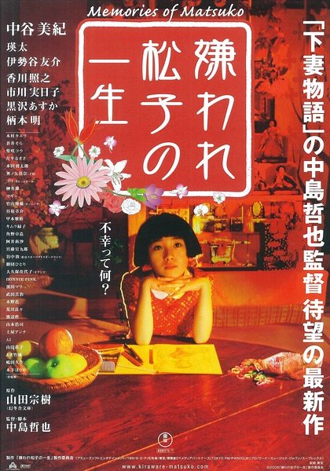

# [&laquo;Memories of Matsuko (2010)&raquo;](https://www.imdb.com/title/tt0768120/?ref_=nv_sr_1)

<div align="center">  </div>

- Director: 中岛哲也<br>
- Writers: 中岛哲也，山田宗树<br>
- Stars: 中谷美纪，瑛太，香川照之，市川实日子等<br><br>
- Date&Location: 11/30/2018, SYSU/351 （木鱼微剧场）

## Storyline
Shou's father Norio finds his son in a rather meaningless existence in Tokyo dominated by alcohol and porn videos. Having left home two years earlier to pursue life as a musician, Shou has left his band and his girlfriend has left him. His father asks a favor, that Shou clean out the apartment of his aunt Matsuko, who he says led a meaningless life until her murder at the age of 53. The apartment is filled with garbage bags and is even more unkempt than his apartment has become, and he becomes intrigued with his aunt as details of her life are supplied by a tattooed neighbor and others. Her feelings of neglect by her father Tsunehiro, who favored her chronically ill younger sister, Kumi, translated into becoming a dutiful junior high school teacher devoted to her students until being forced to resign after being blamed for the theft of some money by one of them. Leaving her family due to the disgrace, she had a series of affairs with lovers who physically abused her and did a stint as a massage parlor girl due to her beauty. After her pimp lover dumped her and gave her share of earnings to his new lover, they argued and after killing him she left by train and contemplated suicide. Dissuaded by a lonely barber, she happily set out to build a quiet life with him until the police came to charge her with murder. Upon her release from prison she silently slipped away after finding that the barber had started a new family. Becoming a "Yakusa Girl" she rationalized that it was better to be on the run with a mobster than be alone. However, her mobster lover rejected her after being released from a term in prison and she became an eccentric recluse. Shou concludes that his aunt fulfilled his ex-girlfriend's parting comment about it being better to give to others rather than expecting to receive.

—Brian Greenhalgh

## Excellent Reviews
- [【木鱼微剧场】《被嫌弃的松子的一生》](https://www.bilibili.com/video/av7540061)

- 木鱼影评：<br>
  擦肩而过的我们，怀着相似却不同的理想，走着相似而不同的道路，唱着同样的一首歌，演奏着这个世界的交响。<br>

  在我看来，直面这个世界的苦难，以及人生的苦难本质，并不是一种颓废，其实是一种勇敢。<br>
  在导演看来，他借松子之手，讲述了人生即是在苦难中的绝望与天生的希望之间抗争的本质，其实是一种诚实。

  这个作品，我觉得与《人间失格》的格调是完全不同的。<br>
  并不是厌恶，并不是绝望。而是“即使世界充满痛苦，众人也都在努力的生存”。<br>
  电影对这个真相本身，进行了诗意与美学的颂赞。<br>

  我觉得这是透彻且坚强的想法。因为无论怎样，这个痛苦与绝望的悖论是无法逃避的。<br>
  而作者告诉我们要背负这些生存下去。

- 生而为人，我很抱歉。（生まれて、すみません(u ma re te、su mi ma se n））

- 摩西在诗篇 90 篇里面说：我们经过的日子，都在你震怒之下。我们度尽了年岁，好像一声叹息。我们一生的年日是七十岁，若是强壮可到八十岁。
  但其中所矜夸的不过是劳苦愁烦，转眼成空，我们便如飞而去。人生中的苦难，总是绵绵不绝，由始至终，以一种渗入骨髓的方式与人的生命共生着
  。在这样强大的苦难之下，本来一死了之是一个很自然的选择，但人却生来，有一个名为希望的生存本能。希望有很多副产品，比如它会让人相信苦
  难得价值，因为如若苦难没有价值，那么为何我们要承受，但真相是，我们不得不承受。和电影一样，我们每天面对令人厌恶至极的罪恶有苦难，却
  不得不给自己带上搞笑的表情，给世界上的无趣加上种种浓烈的色彩，甚至让惨绝人寰的往事在记忆中扭曲成为喜剧。但这并不是一种虚伪，这是一
  种从根源上的无奈。不知道从什么时候开始，我们从小的时候就被告诉这样一个道理：人生是美好的，充满希望的，我们要伸手，去抓那个天上的星
  星，这是来自这个世界的善意。但当我们欣然领受后，成年后，走上世界，才明白并不是这样。这个世界上快乐是短暂的，大部分的时间有苦难来填
  充，我们不觉得，有可能是我们被身边重要的人保护着，还没有独自踏上台阶。罗马书里说：我们知道一切受造之物，一同叹息，劳苦，直到如今。
  有人对松子进行性格分析，认为她怎么做就会更好，认为她太依赖别人，所以导致了自己的悲剧。这样想，其实是没有留意到导演的寓言笔法，松子
  的一生，是追求的一生，也是遗憾的一生，可以说是失败的一生，但却还是认真活过的一生。导演对这种悲剧投入了赞美的情怀，他认为我们无奈却
  精彩的一生，是鲜花铺就的一生。影片最后，大家一起的合唱再直接不过地显明，这并不是松子的一生，而是我们每个人的一生。我们谁不是松子呢
  ？我们充满希望，被苦难打倒，满身伤痕，几乎要绝望，却被希望的本能驱动着继续生存下去。答案在哪里了？可能我们至今没有想到，也可能根本
  就不存在。也可能答案只是我们在行走的路上陪伴我们之物，也可能真理就在我们所看不见却相信的地方。人们选择不同的道路，但这都是我们自己
  的选择。其实，我们的愿望很简单，一个能够对自己微笑的爸爸，一个完整的家庭，一个爱着自己也被自己深爱着的妹妹。所以小小的我们，走着人
  生长长的楼梯，弯着腰，伸长手，想要抓住天上的星星，天上的星星永远在我们指尖的外面。擦肩而过的我们，怀着相似却不同的理想，走着相似而
  不同的道路，唱着同样的一首歌，演奏着这个世界的交响。

## SoundTrack
- [まげてのばして](https://music.163.com/song?id=26439284&userid=265378756)<br>
  演唱者：中谷美纪

    ```
    まげてのばして
    弯弯腰 挺挺背
    お星さまをつかもう
    伸手去摘星星
    まげて 背のびして
    弯弯腰 挺挺背
    お空にとどこう
    一直触碰到天空
    小さく まるめて
    缩成小小的一团
    風とお話ししよう
    和风儿说说话
    大きく ひろげて
    尽情伸展开来
    お日さまをあびよう
    沐浴着阳光
    まげてのばして
    弯弯腰 挺挺背
    お星さまをつかもう
    伸手去摘星星
    まげて 背のびして
    弯弯腰 挺挺背
    お空にとどこう
    一直触碰到天空
    みんな さよなら
    再见啦大家
    またあしたあおう
    明天见吧
    まげてのばして
    弯弯腰 挺挺背
    おなかがすいたら帰ろう
    肚子饿了就回家吧
    歌を うたって
    唱着歌儿
    おうちに帰ろう
    回家吧
    ```


