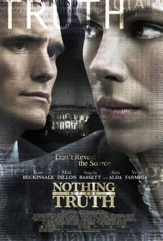

# [Nothing But the Truth (2008)](https://movie.douban.com/subject/2335122/)

  

- Director: 罗德拉里 
- Writers: 罗德拉里 
- Stars: 凯特 贝金赛尔, 马特 狄龙, 维拉 法米加  
- Date&Location: 12/28/2018, SYSU/351 （木鱼微剧场）

## Storyline

女记者瑞秋（凯特·贝金赛尔 Kate Beckinsale 饰）从线人处获得了一份情报涉及政府一次相当不光彩的行为。在丈夫雷（大卫·休默 David Schwimmer 饰）支持下刊登了这起新闻报道。政府最终以泄露国家 机密的罪行将瑞秋推上被告席，主审该案件的则是自负的检察官帕顿（马特·狄龙 Matt Dillon 饰）。在法庭上，面对帕顿的层层逼问，瑞秋坦然地叙述了整个事件的前前后后，公众心中的天平也开始往瑞秋方面倾斜，但是艾伦坚持要求瑞秋必须说出资料的提供者是谁，瑞秋逐渐地陷入进退两难的境地。艾伦开始向舆论和瑞秋的家人施加压力，而雷也渐渐地抵抗不住国家给予的压力，建议瑞秋屈服于国家。但瑞秋向雷表达了自己的坚持：真相至上。

不对吧。电影刚开始把观众的潜意识引向瑞秋坚守职业道德，真相至上的正义，从而让大家对女主的经历产生共鸣与同情。在大家都认为瑞秋的坚持是因为她那真相至上，线人的隐私高于一切的价值观。随着故事情节的发展，尤其是CIA特务离职后被激进分子杀害后，观众开始不由自主的思考，真相是否真的重要？个人的原则在生命面前真的有那么重要吗？瑞秋与此同时，也受到了巨大的精神压力，一方面她陷入了深深的自责，另一方面她有非常想妥协，回归正常的家庭生活。然而，从始至终，甚至在检察官也逐渐妥协，给她争取刑罚减免之后，瑞秋仍然选择斗争到底。看到这里我是非常疑惑的，我设身处地的把自己置于瑞秋的位置，我在最后是会选择屈服于国家力量之前的。但是在影片最后瑞秋的回忆中，这些疑惑又全部烟消云散了。原来瑞秋一直坚持不暴露的线人竟然是CIA特务的女儿。原来瑞秋一路的坚持真相是为了保护小女孩，保护小女孩免于媒体曝光，免于坠入间接造成亲生母亲死亡的内疚与悲痛中。。。

记者真的不是个容易的职业。

## Excellent Reviews

--待续

