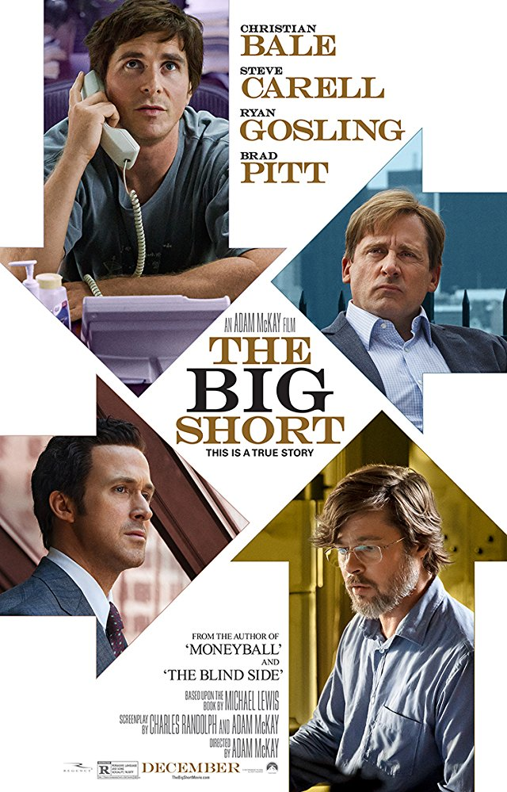

# [&laquo;The big short (2015)&raquo;](https://www.imdb.com/title/tt1596363/)

  

- Director: Adam McKay 
- Writers: Charles Randolph, Adam McKay, Michael Lewis 
- Stars: Christian Bale, Steve Carell, Ryan Gosling, Brad Pitt  
- Date&Location: 11/25/2018, home/Shenzhen

## Storyline
Three separate but parallel stories of the U.S mortgage housing crisis of 2005 are told. Michael Burry, an eccentric ex-physician turned one-eyed Scion Capital hedge fund manager, has traded traditional office attire for shorts, bare feet and a Supercuts haircut. He believes that the US housing market is built on a bubble that will burst within the next few years. Autonomy within the company allows Burry to do largely as he pleases, so Burry proceeds to bet against the housing market with the banks, who are more than happy to accept his proposal for something that has never happened in American history. The banks believe that Burry is a crackpot and therefore are confident in that they will win the deal. Jared Vennett with Deutschebank gets wind of what Burry is doing and, as an investor believes he too can cash in on Burry's beliefs. An errant telephone call to FrontPoint Partners gets this information into the hands of Mark Baum, an idealist who is fed up with the corruption in the financial industry. Baum and his associates, who work at an arms length under Morgan Stanley, decide to join forces with Vennett despite not totally trusting him. In addition to Burry's information, they further believe that most of the mortgages are overrated by the bond agencies, with the banks collating all the sub-prime mortgages under AAA packages. Charlie Geller and Jamie Shipley, who are minor players in a $30 million start-up garage company called Brownfield, get a hold of Vennett's prospectus on the matter. Wanting in on the action but not having the official clout to play, they decide to call an old "friend", retired investment banker Ben Rickert, to help out. All three of these groups work on the premise that the banks are stupid and don't know what's going on, while for them to win, the general economy has to lose, which means the suffering of the general investor who trusts the financial institutions. That latter aspect may not sit well with Baum. Some of these assumptions may be incorrect and may be far more manipulative than they could have ever imagined, which in turn may throw curves into the process.

Written by [Huggo](https://www.imdb.com/search/title?plot_author=Huggo&view=simple&sort=alpha&ref_=ttpl_pl_1)

## Excellent Reviews

下面是一篇质量非常高的影评

* [《大空头》— 泡沫、金融与次贷危机](https://movie.douban.com/review/7745888/)

我看了之后觉得写得很好，就搬过来了，奇文共赏。 
强烈支持去看原文，原文地址：http://i.mtime.com/dresslessleep/blog/7938159/ 
另外还推荐，《大而不倒》 《监守自盗》 《社交网络》 《利益风暴》

《大空头》的剧本来源于美国著名金融记者迈克尔·刘易斯的同名著作 The Big Short。
如果直译的话应该是“一次大规模的做空行动”，在对冲基金行业，这无疑是最激动人心的时刻。
迈克尔·刘易斯在业内久负盛名，因此此书一经出版我就买来看了，读完后的感觉是这是一本在微观/细节层面解读金融危机最棒的书。如果大家有兴趣的话，不用去买书来看，读完这篇文章然后去看电影就可以了！

2008年12月，我在手机上收到一条短信，想必这条短信已经转发了一百万次：
一年前，苏格兰皇家银行花 1000亿美元收购了荷兰银行。如今，同样的一笔钱可以在收购了花旗集团（225亿）、摩根斯坦利（105亿）、高盛银行（210亿）、美林银行（123亿）、德意志银行（130亿）和巴克莱银行（127亿）之后，还剩下80亿美元 …… 用这笔零钱你可以收购通用汽车、福特、克莱斯勒和本田F1车队。
世行首席经济学家，马来西亚人沈连涛（Andrew Shen）在其著作《十年轮回》的开篇，写下了这么一段令所有财经界人士难忘的内容。
然而，次贷危机的影响远远不止于此。
就像“大萧条”导致了金本位的崩溃、第一次全球化的倒退以及法西斯的崛起一样，次贷危机对全球的重大影响也才刚刚开始。

欧洲面临欧债危机。冰岛已经破产，西班牙和希腊的失业率为 25%，年轻人的失业率高达 50%。希腊还面临着非常大的退出欧元区的风险，甚至最终欧元区的土崩瓦解也不是全无可能。
中东和北非在苦苦挣扎。由于经济的持续低迷，突尼斯、埃及、利比亚、也门、叙利亚等国先后爆发了反政府运动，即“阿拉伯之春”，直接迫使多名领导人下台，国家政局陷入剧烈的动荡。
俄罗斯经济崩溃，在绝望中试图用武力把油价打上去.

巴西和阿根廷在严重的通货膨胀与资本外逃/货币贬值的泥沼中难以自拔。
日本在进行史无前例的扩张性经济政策，安倍甚至已经修改了《和平宪法》，日本军国主义有了复活的迹象。
中国积累了前所未见的房地产大泡沫和地方政府债务问题，危机似乎已不可避免。
印度已经连续7年通货膨胀率超过 10%，经济发展模式遭遇严重的挑战。

很多电影都在暗示金融业是一个不创造任何财富的行业，好像是整个社会的寄生虫一般，这是错的非常离谱的。

- 在这篇文中，就让我们从金融业在社会中的作用开始聊起。

金融业对社会的贡献是巨大的，就像我在《不要误解了社会主义》中写到的。正是因为有了金融的运作，即股市的存在，西方国家才得以从19世纪马克思笔下的那种原汁原味的资本主义制度转型成了今天这种半资本主义半社会主义的制度。

我们不妨再拿乔布斯举个例子。如果美国现在的经济制度还是延续着19世纪的传统的话，那么乔布斯很可能就是这个星球上有史以来最富有的人。原因很简单，苹果公司已经连续很多年荣膺全球最赚钱公司了，巅峰时期曾达到过一年赚500亿美元的纯利润，去年虽然下降了不少但依然有390亿美元。
然而我们发现乔布斯在去世时只留下了86亿美元的财富。为什么会这样？原因就在于乔布斯根本就不是一个资本家，苹果公司不属于他，而是属于全体股东——最普通的美国老百姓的（事实上任何人都可以购买苹果公司的股票并拿到现金分红，不仅限于美国公民）。

有关西方是如何完成这一伟大的历史转型的，我在《不要误解了社会主义》中写到了很多，这里就不再赘述了，不过我们必须清楚这一转型的基础，那就是金融业的运作。如果没有金融业，那么我们很可能还处于19世纪马克思笔下的那个资本主义社会中呢。
这里就出了一个问题，既然这样，那乔布斯创立苹果之后，为什么要让它上市呢？为什么不像当年的约翰·洛克菲勒那样把它据为己有，然后取洛克菲勒而代之成为人类历史上最有钱的人呢？

原因在于他做不到。如果他不这样做（上市），那么这样做了的人的公司就会得到迅速的发展，从而远远的将他和苹果公司甩在后面。这些人中的佼佼者，无疑就是比尔·盖茨先生。

1983年，一位非常聪明的年轻人发明了一个可以改变人类生活方式的产品，他便是年仅28岁的比尔·盖茨和其刚刚设计完成的 Windows 操作系统。
如果没有金融业的话，那么盖茨先生只会有能力将它卖给很小范围内的一部分客户（没有足够的营销团队和财力做广告），然后一点一点的扩大业务，仅仅凭借赚到的现金来招收更多的员工。
然而1986年微软公司在 NASDAQ 股票市场完成了上市，并一下子筹集到了一大笔钱，这笔钱帮助微软从一家地区性的小公司迅速的成长为跨国公司。这样，在短短几年之内，全世界的用户都用上了 Windows 这款绝好的操作系统。结果是显而易见的 —— 人民生活水平提高了，盖茨先生也得到了应得的财富。

如果没有金融的运作参与其中，这一过程可能要推后10年，甚至20年。
对于当年那些购买了微软股票的人来说，他们是在“把现在的收入变成未来的收入，但是未来的收入更多了。”微软的股价从上市至今已经上涨了超过一千倍，当初购买了股票的人现在多数都已是百万富翁。
而对于盖茨先生和微软来说，则是“把未来的收入变成了现在的收入，从而改变了未来！”由于有了更多的资金投入研发，微软的产品就可以迅速的更新换代。这个过程甚至改变了大部分人类的生活方式。

当然，金融业的贡献远远不止于此。它还有另一项绝顶重要的功能——资产管理，这就涉及到了股市之外的另一个金融领域——保险业。西方的全民医疗大家认为什么怎么实现的？难道是直接由政府用现金去为每个公民的医疗费用买单吗？
当然不是。事实是由政府为每个公民购买医疗保险，而如何用政府付的钱去为公民的医疗费用买单是保险公司的事。保险公司通过金融的运作，最终可以以很低的成本（保费）解决很大的问题（全民医疗）。
养老金呢？也一样。美国的养老金余额占全世界的65%，超过18万亿美元！而中国的养老金余额仅为3万亿元人民币 …… 我在《激辩余额宝》那篇文中写到过美国人不存钱的原因（储蓄率曾一度在2005年低至 - 1%），因为他们只需将平均每个月20%的收入用来购买保险就足够了，还存钱干什么呢？
因此，陈志武先生在‘我忘记了哪一本’的书中写到：中国人勤劳而不富有的原因就在于金融业太落后了。我相信他的意思应该是我们即没有一个高效的股市可以将资本家的财富合法合理的分配给普通老百姓；也没有一套可靠的保险体系来让老百姓可以在生活的过程中无后顾之忧。

- 接下来让我们聊聊次贷危机吧！

假设现在是2001年，你想在美国买一套价值100万美元的房子，没有多少人有能力用现金买房子，所以你决定用贷款的方式。美国的银行或类似的信贷机构会贷给你多少钱呢？—— 100万，甚至105万，连买保险的钱也贷款给你了。

（一分钱首付都不要的原因并非很多人所想象的美国金融业不负责任，而是因为美国就是一个信用社会。在美国消费基本上都是先拿走东西后付款。美国人虽然没有户口本儿，却人人都有一个名为“信用积分 credit score”的东西。
因此，不管是银行也好还是商家也好，都不会怕你借了钱不还或拿了东西后赖账。因为信用积分高的话，你会发现买什么东西都会便宜很多（会比别人便宜 5% ~ 20% 左右），而信用积分低的话，不仅买东西要更贵，而且以后你在任何地方都别想借钱了）。

这些银行或信贷公司借给你的钱就被称为住房抵押贷款（Housing Mortgage）。如果是在中国的话，那么这件事就到此为止了。但是美国的银行很聪明，他们不想等上20年才收回这些资金，于是它们把这些贷款又以MBS（Mortgage Backed Security）住房抵押贷款证券的形式，卖给了其它金融机构。

什么意思呢？举个例子，假设我是银行A，我贷款了1000万美元给一些顾客买房，于是我现在有了比方说1500万美元（连本带利）的抵押贷款资产，但是这些资产我要分20年才能全部收回来，我不想等那么久，于是我把它以住房抵押贷款证券MBS的形式卖给你，另一家金融机构B，可能以1100万美元的价格（价格由当时的市场利率决定）。
对于你来说，你用今天的1100万美元换了20年1500万美金的现金流，因此你是满意的！对于我来说，我一转手就净赚了100万美元，当然也是满意的。

当我，银行A，把MBS卖给你之后，你就拥有了这些MBS背后现金流（每个月贷款人所还本息）的所有权，但我还是会帮你去贷款买房子的人那里收钱，然后再将收到的钱转账给你。在这个过程中，我是 Servicer 服务者，你是 Owner 所有者。

这个神奇的过程就叫做证劵化！
这样一个过程和中国的那种传统模式有一个本质的不同，便是贷款人违约的风险被转移了。
在传统模式下，如果贷款买房的人违约了，那么银行要遭受很大的损失。而在这种证劵化的模式下，如果前者违约了，遭受损失的人将不再是银行A，因为它已经把这些贷款的所有权（以MBS的形式）卖给了另一家金融机构B，因此遭受损失的人就变成了购买了这些MBS的B。
那么这个所谓的另一家金融机构B，又是谁呢？

房地产抵押贷款证券市场上，有接近一半的MBS 都卖给了著名的房利美和房地美 —— Fannie Mae & Freddie Mac。在2007年次贷危机爆发前夕，它们所发行的MBS总金额高达4.4万亿美元。
不过它们也仅仅是中介而已，房地美和房利美买到这些MBS之后，也根本没打算持有它们到期（20年后），而是会将它们转手卖向全世界 —— 政府（主权财富基金）、银行、对冲基金、保险公司、养老金、个人投资者等等。

在这种情况下，就形成了一个完整的资金流转的链条 —— 从贷款买房的房主直达全世界的投资者。
这相当于全世界的投资者在“资助”美国人民买房，所以美国的房价从2001年开始，以历史上从未有过的速度上涨，泡沫就这样诞生了。

由于房地美和房利美是一种半国有化的企业，因此它们受到了严格的监管。它们只能从银行手中购买最优质的，或者说，违约率最低的房地产抵押贷款证券MBS。
那么它们又如何分辨哪些MBS是优质的，哪些是劣质的呢？

这就要说到全球金融业中可以说是权力最大的三家公司 —— 三大评级公司的作用了。评级公司负责为大多数在市场上交易的证券（包括MBS）进行评级。评级的基础是这些MBS背后那些借款人的原始资料。举个例子，我，银行A，想要发行为期20年，价值为1000万美元的MBS，那么我该如何为它定价？800万，还是900万？这时我就必须去找到评级公司。它们会根据我提供的借款人的资料，例如这些人的信用积分（前文中提到过的这个在美国生活最重要的东西之一，还记得吧？）；个人/家庭资产与负债的比例；以及每年需要偿还贷款的金额与年收入之比（最优级的话一般不能超过40%）。
根据这些信息，评级公司就会给这个MBS评一个级，例如AAA级，意味着评级公司认为这种证券的违约率非常非常低，投资这种债券的风险是很低的。或者C级，也叫“垃圾级”，例如现在希腊的国债，投资这种债券被违约的风险是很高的。购买1000万美元AAA级的MBS可能需要900万，而购买同样金额C级的MBS可能只需要600万。当然是评级越高，卖的越贵了。

由房地美和房利美所购买和出售的MBS（它们俩就像个MBS的分销商），评级必须在 B+ 以上，也就是必须是“优贷”（优质贷款 Prime Loan）。如果这就是故事的全部的话，那么也就不会有“次贷”危机了。
市场中作为MBS分销商的不仅有房地美和房利美，还有大名鼎鼎的各大华尔街投资投行们。
投资银行们（花旗、美林、高盛、雷曼兄弟、贝尔斯登、摩根斯坦利、摩根大通等等 ……）发现，从2001年开始，美国的房价就一直处于稳定的上升期。于是他们推测，即便找一些信用不好的人来放贷，也不会有很大的风险，因为即便是遭遇了违约，只要把房子收回来再卖掉就可以了嘛（抵押贷款证券MBS，顾名思义是以房子为抵押的）。
于是它们开始联合银行和信贷机构去发放更多的“次级债”，也就是开始为信用不好的人提供贷款。
对于发放贷款的银行和信贷机构来说呢？前面已经解释过，由于证劵化的过程，它们可以将这些MBS违约的风险转移给购买了这些MBS的投资银行们，因此它们又何乐而不为呢？越多越好！
因此，“次贷”危机中的次级抵押贷款（Sub-prime loan）或次级MBS，就这么诞生了。

- Okay，现在我们可以聊聊电影了。

在这整个的证券化链条中，哪个环节是最关键的？毫无疑问，是贷款买房的人的信誉，最关键的地方在于他们能否将房贷如期如数的还给银行，再由银行传递给全世界的投资者们。
而当我们了解了整个证券化的过程之后，我们会想，不管是银行也好，还是信贷公司也好，都有动力去为信用级别很差的人放贷，而最终这些信用级别很差的人是很有可能违约的。如果事实果真如我们所想的话，那么未来整个证券化链条的崩塌也便不是不可能的事了。
贝尔（影片中的 Dr. Burry）、高司令（影片中的 Vennett）和影片中的 Mark（Steve Carell 主演）也是这样想的。

影片重点描绘了贝尔和 Mark 是如何去调查的。
贝尔是在电脑前，去阅读那些MBS背后借款人的原始资料。因为他是对冲基金经理，他是买方，所以有权要求卖方（投资银行）提供这些资料。可想而知阅读这些资料是非常乏味的，贝尔仔细阅读了几十份这样的资料，粗略浏览了几百份（每一份都有几百甚至上千人的信息）。在书中，迈克尔·刘易斯这样写到：Dr. Burry 认为自己是这个地球上除了起草这些文件的律师之外，唯一一个阅读它们的人。
（这就解释了一位朋友在评论中所问的一个问题：难道这些金融机构或投资人不会去看看借款人的原始资料吗？很明显，资料就在那里，不过并没有什么人想要花时间看它们，因为有评级机构 …… 后面会讲到评级机构的作用）

在阅读这些资料的过程中贝尔惊奇的发现，在他所阅读过的大部分料中，其中 50%的借款人是没有任何资料的！也就是说只有不到 50%的人提供了收入证明、财产证明、信用积分等资料，而剩下的超过 50%的人是完全没有任何资料的！这意味着什么？意味着不是这些人完全不符合贷款的资格，就意味着银行在放贷时根本就没有要求他们提供任何资料！

那么 Mark 是如何去调查的呢？Mark 的做法是直接走访第一线，去看看银行和信贷公司到底是如何发放贷款的。电影中演到了两个场景：第一，当 Mark 问一家房子的租户 XXX（房屋的主人）是否在家时，租户告诉他那是一条狗的名字，是房主的狗的名字！也就是说，银行贷款给了一条狗！我不知道这是否是真实存在过的事 …… 但2007年4月当新世纪贷款公司破产，次贷危机的第一块骨牌倒下的时候，人们对新世纪贷款公司的形容确实是“它甚至会放贷给一条狗。”不知导演是否从这里得到了灵感。第二个场景便是当 Mark 询问负责给借款人放贷的银行的 Agent “是否曾拒绝过任何人贷款买房的请求”时，得到的答案是：“NO” ~

(再多说两句，真正厉害的投资人都是干这种事的，都是去第一线找第一手资料的。如果只是每天看着所有人都会看的财务报表；听着每天所有人都听的新闻，又如何能比市场的反应更快呢？要知道巴菲特在买了万事达的股票之后是去超市柜台前数有多少人用万事达信用卡的，一站就是一天；买了石油公司的股票之后是去火车站数油罐车的。)

还记得之前讲到虽然借款人的原始资料就在那里，但投资人也不会去看的吗？原因在哪里？因为评级公司会看，评级公司看完之后会给这些MBS评一个级，投资人只需根据评级来判断这些证券的风险就好了嘛。自从1902年 John Moody 创立了 Moody 评级公司之后，这种模式在过去将近一个世纪都运转良好，谁会想到这一次会出问题呢？（Moody 的大股东之一就是沃伦·巴菲特同学，Moody 的商业模式被巴菲特誉为是史上最成功的）

那么一向可靠的评级公司又出了什么问题呢？电影里给出的答案是这样的：当 Mark 一行人拿着他们所搜集的，包含了很多没有借款人任何信息的MBS的资料去质问标准普尔（三大评级公司之一），为什么会给这些MBS评级AAA（最高级别）的时候，标准普尔是这么说的：如果我们不给这些MBS评级为AAA，这些公司就会去找 Moody（标准普尔的竞争对手）了。

这恐怕只能算作电影艺术的一种夸张手法了 …… 且不说标准普尔的人凭什么把“真”话说出来 …… 如果这就是真相的话，那岂不世界上所有的债券都要被评级为AAA了？
那么事实可能是怎样的呢？迈克尔·刘易斯在《大空头》这本书中给出一些解释：一方面，华尔街投资银行的债券交易员们都是一些年收入7位数的人，他们哄骗那些年收入5位数的家伙（评级公司的员工）绰绰有余。事实上，评级公司那些最优秀的员工都纷纷跳槽到了投资银行，帮助自己的新东家去对付自己的老东家。

举个例子来说，FICO评分是用于测算个人借款的信用值，最高850分，最低300分，美国的中位数是723分。Moody 和标准普尔使用的方法是用一个MBS中所有借款人的平均FICO评分。例如AAA评级所要求的FICO的平均分在615分左右，投行们便寻找一半550分的借款人和一半680分的借款人，然后（有目的的）将他们放在一个MBS里，这样这个MBS就可以被评为AAA级了。而事实上一个评分为550分的借款人，断供的可能性是很大的。典型的上有政策下有对策 ……

另一方面，迈克尔·刘易斯在书中写到，当有基金经理去质问评级公司为什么会给明显不靠谱的MBS评AAA级时，得到的回答都是：“住房价格在全国范围内同时下跌是不可能的，过去60多年的数据表明，从未出现过美国全国范围内住房价格同时下跌的情况。”
也就是说，在评级公司看来，由于这些MBS都是抵押贷款证券，即便遭遇了违约，只要把房子收回来再卖掉就可以了嘛（前面分析过）。除非房价下跌了，投资人才会真正的受到损失。然而又由于每个MBS都是由分布在全国各地的房子为抵押的（很正常的一种分散风险的做法），因此除非全国各地的房价同时开始下跌，不然这样的MBS是不会有什么风险的。而自从大萧条之后，美国从未出现过全国范围内房价同时下跌的情况。

这个理由就靠谱多了。
可是评级公司没有想到的是，美国的房地产市场在平稳的发展了80年之后，又经历了一次泡沫，而当泡沫破裂之时，正是全国房价同时下跌之日。

让我们再次回到2001年。
 2001年美国经历了两件大事。第一，从2010年3月开始破灭的互联网泡沫到了2001年开始全面崩溃。第二，美国遭遇了9-11恐怖袭击。袭击之后，金融市场的流动性开始急剧紧缩，一场衰退马上就要到来。
为了应对危机，时任美联储主席的艾伦·格林斯潘开始下调利率，如图，从2001年的6.5%一路下调至2003年的1%。

非常有趣的一点是，当时的诺奖得主保罗·克鲁格曼竟然在《纽约时报》上写了一篇名为《美国应该用房地产泡沫取代互联网泡沫来提振经济》的文章 …… 去年，当《纽约时报》和其死敌《华尔街日报》（前者为左派，后者为右派）再次吵的不可开交时，《华尔街日报》的经济专栏作家竟找出了这篇文章 ……
事实上，美国确实以房地产泡沫取代了互联网泡沫，而房地产泡沫的破裂就酿成了这次百年一遇的金融危机。

人类历史上所有的经济危机，几乎都是由泡沫引发的。简单的说，都是从流动性过剩（钱越来越多）开始，接着出现投机热，最终形成泡沫，而后发生崩溃。
美国的房地产泡沫就是从2001年美联储主席格林斯潘降息，也就是制造流动性过剩开始。
因此，在次贷危机爆发后，很多很多人都将责任归咎于这位在位16年的美联储主席。（可能由于在内心深处对中国的货币政策十分不满吧 …… 我昨天晚上竟然梦到了有朋友跟我说中国央行行长周小川被罢免了 …… ）

不过，前任美联储主席本·伯南克在耶鲁大学的演讲中为格林斯潘做出了辩护，他认为资产泡沫和央行的货币政策之间并没有必然的联系。
伯南克的理由是：
从2001年到2007年，英国的货币政策要比美国紧缩的多，美国是从6.5%下调到1%，并且在1%的位置上停留了一年之久直到2004年年中，而英国则是从2001年的5.75%下调至2003年最低的3.5%，远高于美国的1%，且在3.5%的位置上也仅停留了三个月，就在2004年年中迅速上升到了4.5%，而此时美国的利率还仅为1%。随后两国都开始上调利率，至2007年次贷危机爆发前，两国的利率均为5%左右。
可见英国的货币政策并不宽松，而英国的房价却在2001年到2007年之间上涨了超过100%。反观美国，在货币如此宽松的情况下，房价在同一时间内则仅上涨了72%。

更有说服力的对比来自德国和西班牙。
两国共用同一个央行 —— 欧洲中央银行，因此两国在执行完全相同的货币政策，然而西班牙的房价从2001年至2007年却上涨了145%之多，而德国房价却仅上涨了1%。我在《中国经济2015》中写到了有关德国是如何通过政府政策来抑制房价，以及西班牙是如何通过政策来抬升房价的。
1%的利率对炒房者来说，炒房的代价降低了；但对于企业来说，投资研发新产品的代价也降低了呀。一个社会中不管是钱多了还是钱少了，都有一个资金的流向问题，因为资金不可能平均的覆盖每一个行业。

在我看来，如何去引导资金，使其流向对社会更有益的领域，就需要政府卓越的眼光和能力。
（例如新加坡就对炒房所获得的利润征收100%的资本利得税，也就是说你1年前花10万买个房，1年后卖了20万，那你就给政府交10万的税吧！而且你还要负担一年的房产税，也就是说，如果你买房的目的是炒房的话，那么你的收益肯定会是负的！这不就解决房价问题了吗 …… 这有什么难的？对社会也不会造成任何负面影响，反而为人民传递了一种公正的价值观）

现在世界上很多人鼓吹小政府，鼓吹政府什么都不要管，让市场自由发展。事实上，世界上人民生活最幸福的国家，挪威、瑞典、丹麦、法国、芬兰等，都是大政府国家。而世界上政府最小的发达国家 —— 美国，恰恰也是发达国家中贫富差距最大（基尼系数仅比中国低一点点），人民生活最苦的国家。问题就在这里，如何引导资金的流向是一个极为深刻的经济学命题，它需要政府的深谋远虑！是流向穷人 —— 挪威、瑞典等；还是流向房地产 —— 中国、西班牙；是流向高科技 —— 美国、日本；还是流向金融 —— 英国、冰岛、爱尔兰。如果政府什么都不管，那么托马斯·皮凯蒂在其划时代的名著《21世纪资本论》中已经给出了足够详细的解释：贫富差距会越拉越大，财富会毫不犹豫的向收入最高的1%的人群集中。

可以看出，我是崇尚大政府的。这句话在中国可能会引起误会。然而中国经济发展的问题，并不是因为政府管的太多了，而是因为政府管的方式不对。未来还会写文章来分析这些问题。

回归主题。说完了流动性过剩（变钱多了），我们再来聊聊投机热和泡沫。
两年前的一个下午，我和好友沿着珠海的海岸线散步了一个小时（那时我们经常这样），一路走过来沿途全部都是在建的住宅区，每一栋都有二、三十层那么高。我很好奇，等这些房子建成了，谁去住呀？
于是我跟朋友聊起了对冲基金经理乔治·索罗斯的“反馈环”理论。

索罗斯大学读的是经济学，不过他对于经济学中有关市场价格最终会达到均衡的结论非常怀疑。他认为，在一个市场中价格是很难达到均衡的，而是会像一个钟摆一样，在均衡价格那条线的左右两端来回摇摆。
什么意思呢？
就拿现在A股的创业版来说吧 ~ （写这段话的时候是2015年4月，当时A股高达5000点 …… 现在泡沫已经破了吧？）
创业板的市盈率已经达到了恐怖的100倍！远远超过了均衡点。可是为什么它还在涨呢？

原因很简单。因为它过去一直在涨！
当股价上涨的时候，会吸引很多人携带资金进入市场。当更多的人进来后，价格就会继续上涨，这又会吸引更多的人进入市场。价格更高了，又会吸引更多的人进入市场。于是价格更高了 ~~~
这就形成了一个“反馈环”。
它当然是非理性的。总有一天，市场中会有越来越多的人会意识到它是一个大泡沫（一般是专业人士，例如李嘉诚已经撤离了中国房地产市场），这时候就会带来崩溃。
崩溃的时候依然会产生一个“反馈环”。
卖的人越多，价格就越低。价格越低，卖的人就更多。
最终价格也不会停留在均衡点，而是会跌破均衡点。

此时崇尚价值投资的“巴菲特们”就开始进场抄底了。
再开启新一轮循环。
所以当时我对朋友说：不用看任何数据，我就能肯定中国房地产市场会积累起一个大泡沫，并且一定有崩盘的那一天。

因为这是市场规律。

美国也是这样积累起了房地产泡沫（当然这其中除了有政府政策的支持之外，还有金融业的推波助澜）。那么它又是如何崩溃的呢？
我们知道，泡沫往往来源于流动性过剩 —— 低利率政策（虽然两者之间没有必然的因果关系，但后者确实是前者的必要条件）。而泡沫的崩溃，则往往来源于流动性的收紧 —— 高利率政策。
我们知道，正是美联储从1999年5月到2000年5月数次提高利率 —— 从4%提高到6.5%，直接导致了互联网泡沫在2000年的崩溃。再往前说，1990年，日本央行为了控制通货膨胀率，将利率从1%提高到3%，直接导致了“平成泡沫”的崩盘以及其一个又一个“失去的十年”。又例如2007年上半年，我国央行连续12次加息以应对通货膨胀，股市和楼市都在2007年下半年崩溃。次贷危机的导火索也不例外，2004年年中，时任美联储主席的格林斯潘开始加息以应对通胀，如图，从1%一路上调至5%。美国的房地产价格也开始在2006年回落。正是房地产价格的回落引爆了次贷危机。
当货币供应量增长的速度追不上泡沫增长的速度时，泡沫就会破裂。

任何做投资的朋友，不管是炒股的还是炒房的 ~ 一定要记住这句话哈，别到时候市场崩盘了都不知道是怎么崩盘的。事实上，在市场崩盘之前撤出资金，并不是一件很难的事情。

继续说回美国。

在美国的购房政策中，有一条被称为“ Foreclosure 止赎权”。也就是说，利用贷款购买了房子的房主，可以在任何时候放弃房子的所有权，将房子退还给银行，同时停止偿付贷款（当然之前已经还的金额也是要不回来的）。
在以前，我误认为在房价下跌的时候，会有很多人主动执行止赎权把房子退还给银行，因为当他们发现房子的市场价值已经低于自己要偿还的贷款金额时，干嘛不行使止赎权然后重新以更低的价格去买一套呢？于是我认为这是美国房地产崩溃的主要原因。

然而事实并非如此。来到美国之后，我才发现信用积分这个东西对美国人来说有多重要 …… 也就是说，你当然可以行使止赎权把房子退掉，但这种被称为“战略性违约”的行为会让你的信用积分大幅下降，用我美国投行朋友的话说，Foreclosure equals death，“行使止赎权等于死亡”。
如果不是房价下跌导致了借款人违约率的上升，那又是什么呢？
《大空头》再次给我们提供了答案：1996年时，有65%的贷款是固定利率的，而到2005年时，75%的贷款变成了浮动利率。

举个例子：
我贷款100万美元买了一套房，利率是1%，为期20年的话我一共要还122万，每个月还5000美元（想不到写影评还要用到金融计算器 ……）。如果是固定利率贷款的话，那么我只用每个月还5000美元，还20年就行了。

然而对于银行来说，银行知道利率不可能长期在 1%这么低的位置停留，未来利率一定会升高，因此如果我20年内都只让你付 1%的利息的话，那银行不就亏死了。因此银行在贷款的时候不会和你签固定利率贷款合同，而会跟你签浮动利率贷款合同。这个利率可能是美联储的联邦基金利率 + 1%。假设现在的联邦基金利率是 0%，那么针对你这笔贷款的利率就是1%，你依然每个月还5000美元。然而当美联储开始在2004年加息！联邦基金利率变成了 1%，那么针对你这笔贷款的利率就会变成 2%！此时你就不是每个月还5000了，而是变成还6200！更不用说格林斯潘一路把利率从 1%提高到了 5%了！猜猜在6%的利率水平下你要还多少？每月13363美元！几乎是每月5000美元的三倍。

此时我们可以发现，在利率不断上升的时候，且不用说那些次级贷款的借款者了，就是优质贷款的借款人都有可能惊讶的发现自己还不起贷款了。于是有大量的人在2006年开始被迫行使“止赎权”，将房子退还给银行。
当利率为 1%的时候，贷款100万买房，20年内只需要还122万；而当利率为 6%的时候，贷款100万买房，20年之内要还322万。因此在一方面，这会直接导致买房者的数量大幅下降。另一方面，大量的人（尤其是像电影中那位脱衣舞女那样拥有5套房子的人）开始被迫将房子退还给银行。而银行拿到房子之后，则不得不将房子马上低价拍卖。
（在另一本描述金融危机的著作里，甚至提到了一对英国夫妇曾购买了99套房子。一旦利率开始上升，这样的人是100%要违约/断供的）

在以上两个因素的相互作用下，美国的房地产业迎来了大萧条之后的第一次全面下跌。
大量的MBS开始遭遇违约，全世界所有购买了这些MBS的投资者 —— 政府、银行、养老金、对冲基金等等进而都遭遇了严重的亏损。次贷危机就这样，由美国迅速波及了全世界。当全世界都陷入危机时，像中国这样虽然与MBS没有多少交集但严重依赖出口的国家当然也不能幸免。

正如电影中演的那样：
2007年4月，新世纪房屋抵押贷款公司破产；
几个月后，五大投行之一的贝尔斯登旗下的两只对冲基金由于严重亏损被关闭；
紧接着便是股市崩盘。
整个电影的高潮也在2008年9月，五大投行之一，有着150年历史的雷曼兄弟的破产中迎来。

数百万美国人（由于还不起贷款）开始被银行赶出他们的房子。（纪录片中记录了当警察去加州的住户家中试图将他们强制赶出房子时，一位无依无靠的老人无助的坐在沙发上，当着他们的面开枪自杀的镜头）
数百万美国人丢掉了工作。

电影最感动我的一幕就是当房地产市场最终开始崩溃，当跟着布拉德·皮特卖空了MBS的两位对冲基金经理高兴的手舞足蹈（他们马上就要赚一大笔钱）时，布拉德·皮特严肃的对他们说：

You know what you just did? 
You bet against the American economy. 
If you win, people lose homes, people lose jobs. 
Don't you dance about it.

你们知道你们刚刚做了什么吗？ 
你们在对赌美国经济。 
如果你们赢了，人们会失去房子，人们会失去工作。 
别在我面前为此而跳舞。

-  这里还有一个问题。

在这个传导链条中，从表面上看，银行和信贷公司是没有风险的，因为它们将MBS都卖给了投资银行和房地美、房利美，对吧？即便借款人违约了，也是后者受损失。然而投资银行和房地美、房利美也是没有风险的，因为它们又都将MBS卖给了全球的投资者，即便借款人违约了，受损失的也应该是全球的投资者呀。
那为什么我们看到在次贷危机中，反而是银行、信贷机构、投资银行、房地美和房利美先面临破产呢？

原因就在于，这些MBS资产都有一个存货期。银行和信贷机构肯定是一边放贷，一边找买主，就像企业一边生产一边卖产品一样，在任何时间，它们手中肯定都会积攒很多贷款/MBS存货。投资银行也一样，它会一边购买MBS，一边打包分散风险（前文中讲过，将不同地区的或不同信用等级的MBS放在一起），一边找买主。同样，它们手中也积攒着很多MBS存货。
当市场开始转差，它们手中的这些MBS就会大幅跌价，甚至到根本卖不出去的地步，可是购买这些MBS的钱已经付了出去，如果卖不掉，就会给它们带来极大的损失。
可手中一点点存货的亏损，就能够让一家存在了150年的全球五大投行之一的雷曼兄弟破产吗？

能的。
原因在于它的杠杆率实在是太高了。

什么是杠杆率呢？
杠杆率（Financial Leverage） = 总资产/核心资本

核心资本就是银行的自有资本，假设我有5元钱，然后借了95元钱去炒股，这时我的总资产就是100元钱，核心资本则是5元。杠杆率就是100/5 = 20倍。
此时，假设我炒股亏了6% —— 总资产损失了6%，我的总资产就剩下94元了，而我的核心/自有资本只有5元，我的负债却是95元，就会直接导致我的总资产已不足以还债了 —— 94 < 95，因此我破产了！
也就是说，当我的杠杆率为20倍的时候，我的资产只要缩水超过5%，我就要破产。可以看出，杠杆率越高，银行的风险就越大。

那么美国五大投行的杠杆率在2007年到底有多高呢？
2007年年底，它们的总资产达到了4.3万亿美元，而自有资本仅为2003亿美元，也就是说，它们的杠杆率达到了21.3倍！
在如此高杠杆率的情况下，又怎么可能扛得住全美房地产价格同时下跌，房屋贷款违约率在2007年飙升至20%以上的打击呢？

相比之下，欧洲的银行们更为危险：
声名卓著的瑞士信贷银行（Credit Suisse）在2007年的杠杆率为33倍；荷兰国际集团（ING）达到了49倍；德意志银行（Deutsche Bank）高达53倍；英国的巴克莱（Barclay）则高达61倍。
（这也是欧洲必须拯救希腊最重要的一个原因，因为欧洲银行业的杠杆率太高了，根本无法承受希腊违约所带来的后果）

难道政府不监管，就任由它们的杠杆率这样飙升吗？

事实上，在2004年以前，美国的银行业有规定的，这个规定是银行的杠杆率不得超过15倍。然而这一规定在2004年被美国的证监会 SEC 给取消了。多么令人匪夷所思的一个事件。
提到 SEC —— 美国的证监会（负责监管美国金融业的一家政府机构）在次贷危机中的失职，《大空头》这部电影也提到了一部分原因。其中一个场景便是片中某位角色的妹妹本来在 SEC 就职，却对这位角色说她想去高盛（五大投行之首）工作，原因很简单，高盛的工资是 SEC 的数倍 …… 然后当这位小美女看到泳池边的一位帅哥时，就蹦蹦跳跳的过去了，边走边甩下一句话：他在高盛工作 ……

确实，很多书籍和纪录片都提到了这个问题，不论是评级机构也好，还是美国证监会也好，它们员工的工资都只有投资银行员工的几分之一甚至十几分之一。美国人也爱钱，尤其是华尔街 …… 因此最有才华的人肯定都去了投资银行。你让一群次有才华或没有才华的人去监管这世界上最有才华的年薪普遍达到七位数（美元）的一群人，确实有点难啊 ……

要看懂电影，还有两个名词必须搞清楚.就是 CDS 和 CDO。
当贝尔跟他的老板讲他要做空MBS时，他的老板对他说的是：“你怎么做空？没有工具啊！”
贝尔笑着回答：“我要让他们（投资银行）给我创造一个。”
这个工具就是 CDS，Credit Default Swap 信用违约互换！

我们先来谈谈卖空是什么。卖空就是靠赌资产价格的下跌来赚钱。一般的做法是先问别人借一些资产，比方说问别人借价值100万美元的股票，然后马上以现在的市场价100万把这些股票卖掉。过一段时间之后，当股票价格下跌时，比方说跌到了50万美元，再以50万美元的价格把这些股票买回来，还给当年借你股票的人，就可以净赚50万美元。

对冲基金可能是世界上最刺激的行业，而卖空又是对冲基金行业最刺激的一种行为！原因很简单，当市场价格已经在下跌时，每个人都会急着出手，是不会有人把资产借给你的。只有当市场价格在上涨时，你才有可能借的到资产。因此，卖空这种行为，就是以一人之力去对抗整个市场！例如1992年乔治·索罗斯卖空英镑的行为，就是在对抗存在了400年之久的英格兰中央银行 ……

如果最后你赢了，就说明你战胜了市场，你是市场中极少数看到了未来的人。因此巴顿·比格斯在其名著《对冲基金风云录》中这样写到：所有的对冲基金经理都将一次成功的卖空行为作为一生最大的成就，许多人都为此付出过巨额亏损的代价。毕竟战胜市场这件事还是没那么容易的 ……

贝尔是如何使用 CDS 去卖空 MBS 的呢？CDS 并不是贝尔发明的，而是于1993年由摩根银行发明，一经发明立刻改变了整个金融业，和证券化一起可以位列金融史上最伟大的发明之一。
CDS 是一种保险合约，假设我想把一个MBS卖给你，但是如果你怕它违约怎么办呢？你可以花一笔钱去向一个第三方（也可以向我）购买一个 CDS 合同。这样假如这个MBS违约了，这个第三方可以给你赔偿，保证你不会遭受任何损失（除了买 CDS 合约的钱，和保险与保费的概念一模一样）。

贝尔心想，当MBS开始大规模违约的时候，为其保险的CDS的价格一定会大幅上升，就好像飓风袭来之前房屋保险和医疗保险的保费一定会大幅上涨一样。如果在此时去囤积大量CDS合约的话，那么当次贷危机爆发的时候，当MBS违约率大幅上升的时候，这种对MBS保险的CDS的合约价格一定会涨到天上去！到时贝尔就可以大赚一笔了。

小插曲 ~

2001年当高盛通过财务造假将希腊送进欧元区的时候，高盛早就预料到了希腊会爆发债务危机，因此在同一年向德意志工业银行购买了为期20年，价值10亿欧元的为希腊国债做保的CDS合约。当2009年希腊债务危机爆发时，这些CDS合约的价格暴涨了40倍！
那么为什么之前没有人将CDS合约应用在MBS上呢（为MBS买保险）？就是因为市场中没有人认为MBS会出问题，为MBS买保险就好像为男人买怀孕保险一样荒谬，因此市场中也没有人去卖这样的CDS。
直到贝尔（影片中 Dr. Burry）的出现。

我们看到，影片中当贝尔找到高盛银行希望购买为MBS做保的CDS合约时，高盛的人将其形容为“如果您想白给我们钱的话，我们当然是没有意见的 ……”当贝尔走出高盛的办公室后，我们还看到镜头里的高盛员工们全部都笑的前仰后合 …… 因为在他们看来，贝尔简直就像是刚刚向他们购买了针对自己的怀孕保险一样。
（贝尔并不是随机的为MBS买保险，而是通过仔细阅读了很多MBS背后借款人的资料，最终选择了6份他认为最有可能违约的MBS，并购买了价值6000万美元的CDS，为每份MBS合约保价1000万美元）

高盛将这件他们认为很逗的事传了出去。
（事实上高盛也是很厉害的，只不过没有贝尔发现的那么早而已。高盛的两个员工是在2007年年初发现这件事的，于是也开始大规模购买CDS合约。由于高盛财大气粗，最后这两位员工为高盛赚了超过40亿美元的利润。有趣的是小气的高盛竟只给每个人发了1000万美元的奖金。最后的结果是两人愤然辞职并一起成立了属于自己的公司）

高司令（影片中的 Vennett）听说了这件事，经过自己的调查确认了之后，也开始购买CDS合约。并将这件事告诉了（影片中的）Mark。随后有两位年轻人在某家银行大堂的茶几上发现了贝尔的文件（具体细节我忘了），但由于他们的公司规模太小，没有资格购买CDS合约，于是他们找到了皮特（影片中的 Ben）来帮他们购买。

还有一个问题，就是在电影中我们会发现在危机爆发之前，参与了这次卖空行动的每个人都非常紧张，面临巨大的压力。原因就在于他们将所有能动用的资产都用来购买CDS了，而购买CDS是要花钱的，就像保费一样，每个月都得付钱。因此在危机爆发前，他们基金的总资产都会不断下降，而资产的下降就会导致投资人撤资，因此他们这样做必须顶住很大的来自老板和投资人的压力。这一点影片主要通过贝尔来表现。

影片非常精彩的一个设计就是贝尔会一直在他办公室门口的一块板上写下自己基金净值变动的百分比。刚开始是– 9%，然后到 – 11%，后来是 – 19.3%，最后，当一切尘埃落定，贝尔走出自己的办公室，在那块板上写下了 + 489% …… 也就是说，如果你在2005年投资了100美元在贝尔的公司，那么到2008年它就会变成489美元。

还有一个让我印象深刻的场景是由于受不了投资人接踵而来的撤资要求，贝尔对所有投资人发了一封禁止后者从他这里撤回资金的邮件。这相当于一家银行突然宣布从明天起所有储户都别想取钱了一样 …… 当然，他得到的第一封回复邮件的标题就是：

“ I'm suing！我要起诉你！”

（贝尔我爱你 …… 《蝙蝠侠》都没让我爱上你，这部电影让我爱上你了…… 谁让你演了这么酷的一个对冲基金经理呢！注意！这不是单纯的花痴，而是对演技的称赞 …… 喜欢贝尔的影迷一定不要错过这部电影！）

再说说 CDO，Collateralized debt obligation。

这一幕主要发生在影片中Mark和一位CDO经理的对话中。CDO就是将一大堆MBS放在一起，形成一个资产池，然后由一位CDO经理来管理，通过买卖其中MBS来赚钱的公司（MBS的价格是会随着市场环境而波动的）。在这里，一份份MBS就像一只只股票，而CDO就像一家股票基金，CEO经理则是这家公司的基金经理。而电影中出现的CDO Square，“CDO平方”就像基金的基金一样，不是为投资者直接挑选股票来买卖，而是通过为投资者挑选不同的股票基金来赚钱。CDO平方就是为投资者挑选CDO的公司 …… CDO对次贷危机和金融系统的影响并没有那么大。真正问题的关键还是在于所有这些资产的基础 —— 借款人的违约。

* 电影讲完了，最后再说说许多人对次贷危机的误解。

只要是批评金融业的作品，就一定会强调政府为了拯救这些金融机构，花了超过8000亿美元纳税人的钱。
但事实上，这些钱都用来购买这些金融机构的优先股了。
优先股我们可以把它想象成一种债券，每年有8%~12%的利息。
在次贷危机最严重的一年过去后，被拯救的金融机构们都纷纷偿还了当年政府援助它们的钱，也就是赎回了优先股。
在这个过程中，政府不仅没有亏钱，反而为纳税人赚了不少。
所以别再拿纳税人的钱说事儿了.

还有一个误解。

有人说次贷危机爆发的一个原因是因为激励问题。也就是当市场形式好的时候，这些金融机构的 CEO 们大赚特赚，而万一公司破产倒闭了，他们又不会受到什么影响，因此这是在激励他们去做更为冒险的事情。
事实上并非如此。在美国的公司治理制度下，CEO 们都会购买大量自己公司的股票。这很容易理解。如果连公司的 CEO 都不买自己公司的股票，那外人谁还敢买？例如吉米·戴蒙在2005年接管摩根大通时，就用自己一半的财富购买了摩根大通的股票。

因此，当贝尔斯登以每股2美元的价格被出售给摩根大通（一年前还高达170美元），当雷曼兄弟破产，股价变得一文不值，受损失最大的恰恰是这些公司的CEO 们 —— 他们都亏损了数十亿美元。如果以亏损金额占个人资产比例做一个排序的话，那么他们很可能正是这次危机中损失最大的人。
因此我们不能将次贷危机爆发的原因归咎于所谓的“激励机制”，这是不符合逻辑的。

P.S.

贝尔演的太好了！不过由于戏份太少，估计很难获得最佳男主了。 
皮特的出场时间加起来不超过10分钟，片尾看到皮特是 producer 的时候瞬间想明白了。 
刚看完电影的时候发了微评说这是今年的奥斯卡最佳影片 ~ 补充一句，今年有可能入选最佳影片角逐的电影我只看了三部 ——《火星救援》、《乔布斯》和这个，因此我的意思是，它是这三部里最好看的 ……

Merry Christmas ^.^

* 附录 ~~

对于金融从业人员，或对金融业特别有兴趣的朋友们。
我们还可以来看看证劵化的过程在实际操作中是如何实现的。它涉及到了两个著名的词汇 —— “SPV特殊目的工具”和“表外融资”。

依然假设我是银行A，我的资产负债表上有20亿的 Receivables 应收账款（那些贷款买房的人欠我的钱），如果我不想等20年而是现在就想把它们变现，我就会选择，比方说，以16亿的价格卖给你，金融机构B。但事实上你并不会想要买我的贷款，因为这么一笔巨大的资产，流动性也非常差，如果需要的话，你很难把它转手卖给别人。于是我想了个办法，我把这些贷款变成一份一份的MBS，然后再卖给你。这种东西在市场上的流动性非常高，如果你愿意，你随时可以再把它转卖出去。举个例子，就好像我现在有一家公司，我想卖给你，你不愿买，因为流动性太差，于是我把我公司的资产变成股权，然后卖你股权，你肯定就愿意了，因为你可以随时再把这些股权转卖出去。

那么这个MBS是个什么东西呢？它只是一种协议，这个协议的内容就是你现在给我1.6亿美元现金，我在未来的20年内分期还你2亿美元的现金（签10份）。而且如果有人违约了，我可以收回他的房子去卖，然后把卖得的现金给你作为补偿。

当我们签完这样一个协议之后，我，银行A会发现我的资产负债表上资产项目多了16亿美元的现金，但负债项目突然多了20亿美元 Payables 应付账款，这样一下就让我的资产负债表变得很难看，如果这样的事做的多了，还会违反例如金融杠杆限制的监管规定。

于是我又想了一个好办法！

我先成立一家独立的公司（注意，不是子公司，而是完全独立于我的公司），然后我把贷款卖给它！然后它再把它们变成MBS再卖给你（你去跟它签那份本该和我签的协议）！

这样一个过程，对我来说有好处也有坏处。

坏处在于我成立这样的公司是要花钱的。好处在于我实现了传说中的“表外融资”！此时我的资产负债表就不再是资产多16亿，负债多20亿了，而是变成了资产少了4亿（由20亿变成了16亿），但它们由20年的应收账款变成了16亿的现金（而为了得到这16亿我可能仅花了15亿喔）！我马上又可以用这16亿去干同样的事了！

（还有一个好处就是我这些MBS的利息会低于我去发债券融资的利息，因为这家SPV是 Bankrupt Remote 破产风险隔离的 ……）

对你，金融机构B也是既有好处也有坏处。

好处和坏处都在于这个SPV是“破产风险隔离”的，意思就是说在这20年中，由于所有权已经从我这里转移到了SPV那里，因此如果贷款违约了，那么只能由它来承担了，但是它没有多少资本呀！它只是一个SPV而已，因此恐怕只能您来承担了 …… 但好处在于，如果我，银行A破产了，那么它，SPV，以及你对于这些贷款现金流的索取权是不会受到任何影响的。因为我对它来说，也是破产风险隔离的。* //

