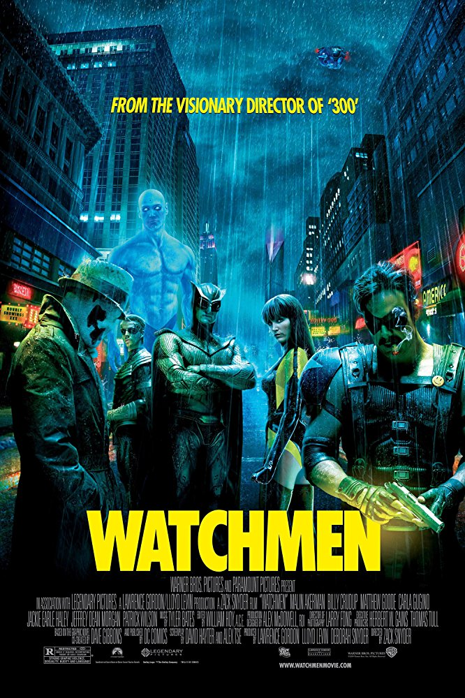

# [&laquo;Watchmen (2009)&raquo;](https://www.imdb.com/title/tt0409459/?ref_=fn_al_tt_1)

<div align="center">  </div>

- Director: Zacl Snyder<br>
- Writers: Alan Moore (writer)<br>
- Stars: Patrick Wilson, Malin Akerman, Jackie Earle Haley (Rorschach 罗夏), Matthew Goode<br><br>
- Date&Location: 12/17/2018, SYSU/351 （[爱奇艺](https://www.iqiyi.com/v_19rrjuparc.html?flashvars=videoIsFromQidan%3Ditemviewclkrec#vfrm=5-7-0-1)）

## Storyline

It's 1985 in an alternate reality. The Watchmen - comprised of the Comedian, Dr. Manhattan, Nite Owl II， Ozymandias,
Rorschach and Silk Spectra II - are a disparate band of masked superheroes. The Comedian belongs to both groups. When
the Comedian is murdered, Rorschach, as the only one still on the streets, believes the murderer is out to kill all
the Watchmen, despite any number of people wanting to kill the Comedian for being a misogynist. Evidence points to it
perhaps having something to do with an imminent attempt of nuclear annihilation. As Rorschach continued to investigate,
what they discover is an age-old conspiracy to change the balance of power in a world not different from our own.

## Excellent Reviews
- [【努力的Lorre】DC排名第一的漫画《守望者》导读](https://www.bilibili.com/video/av10174694)
- [【木鱼微剧场】《守望者》伟大而平凡的英雄们](https://www.bilibili.com/video/av23252223)

### 短评：

当时看完这部作品，就一直感叹原来高贵的人格可能并不有助于人类的历史，相反还有可能阻碍历史的进程。这里面我最喜欢的应该就是罗夏（好像好多人都是），但是罗夏又必须得死，无关他的品行，或者说正是由于他高尚的人格所以必须死，而杀他的人有没有错，如果是我也会这么做的，这或许就是最大的矛盾。至于法老王和曼哈顿博士，虽然也是具有鲜明色彩的，但是角色塑造没有罗夏来得精彩（并不是贬低，这两货的形象也是史诗级的，很多好作品里最好的形象可能都没这两人精彩）。当然其他的英雄也是，很难想象这是上世纪80年代的作品，意识太超前了。后面有很多借鉴法老王和博士形象的，为了人类背负罪恶什么的啦（笑），但是罗夏真的很难再塑造一个出来，这个角色太难把握了，而且需要大量形象丰满的人物做陪衬，简直了，我对作者真是佩服的五体投地。

木鱼：一般的超级英雄作品，是带有一种天然的童话属性的，因为实际上这些故事从来没有认真考虑过侠客是否真的可以拯救世界，又或者是从现实意义上认真探讨侠客行为的正常性。毕竟，侠客本质上是一种以个人力量为依托，以个人的道德善恶管来决策的行为模式。只不过，人们在看这些作品时，会在脑中放上一张窗户纸，不去多想。但《守望者》就是捅破了这层窗户纸的作品，它认真的探讨了，如果人类本身有缺陷，如果这个世界并不美好，人类到底能不能自救，而人类中杰出的超级英雄们，能不能帮助人类自救的命题。

我：本来以为是一步关于超级英雄的影片，看完发现影片的英雄是如此血肉丰满，每个英雄的思想境界都不一样，因此作出的选择也不一样。纵观影片，曼哈顿博士的境界高的优点不食人间烟火，毕竟是神，不过他最后也开始感受到生命的奇迹。法老王的谋略不好意思评判，他的方案确实是电车难题的答案之一，创造外部矛盾使团队能够一直对外。而罗夏和Comedian两个人则是最有个人魅力的。因为他们明知前路黯淡，却一直坚持自己的初衷。如果是你，你会选择坚持自己还是妥协呢？我想这个问题我们每个人都有机会面对。

## Music
```
The sound of silence
寂静之声
Simon & Garfunkel


Hello darkness my old friend.
嗨 暗夜 我的老朋友
I've come to talk with U again.
我又来和你聊天啦
Because a vision softly creeping.
因为幻觉在悄悄地袭来
Left its seeds while I was sleeping.
在我的睡梦中埋下种子
And the vision that was planted in my brain.
脑海中的幻象生根发芽
Still remains.
仍在缠绕着
Within the sound of silence
在这寂静之声中


In restless dreams I walk alone.
在辗转难眠的梦中我独自漫步
Narrow streets of cobble stone.
在铺着鹅卵石的羊肠小道上
'Neath the halo of a street lamp.
在路灯昏黄的灯光下
I turned my collar to the cold & damp.
我把衣领立起来抵挡冰冷潮湿
When my eyes were stabbled by the flash of a neon light.
当闪烁的霓虹灯刺入我眼帘
That split the night.
撕裂了夜
And touched the sound of silence.
然后触碰到了寂静之声


And in the naked night I saw.
在茫茫夜幕下 我看到
Ten thousand people maybe more.
成千上万的人们
People talking without speaking.
人们说而不言
People hearing without listening.
人们听而不闻
People writing songs that voices never share.
人们谱写无人吟唱的乐章
And no one dare.
但是无人敢
Disturb the sound of silence
打破这寂静之声
"Fool" said I "U do not know.
我说 愚蠢的人们啊 你们不知道
"Silence like a cancer grows.
寂静就像顽疾滋长
Hear my words that I might teach U.
倾听我的言语我可以教诲你
"Take my arms that I might reach U.
抬起我的臂膀我可以触到你
But my words like silent rain-drops fell
但我的言语就像寂静雨点簌簌滑落


And echoed in the wells of silence
在这寂静之井中回荡


And the people bow & prayed.
人们叩首祈祷
To the neon God they made.
向着他们创制的闪耀的神
And the sign flash out its warning.
神迹发出警示
In the words that it was forming
它告诉人们
And the sign said "The words of the prophers.
神迹说：预言家的话
Are written the subway walls & tenement halls".
写在地下道的墙上和房屋的走廊
And whispered in the sounds of silence.
在这寂静之声中轻轻低吟
```